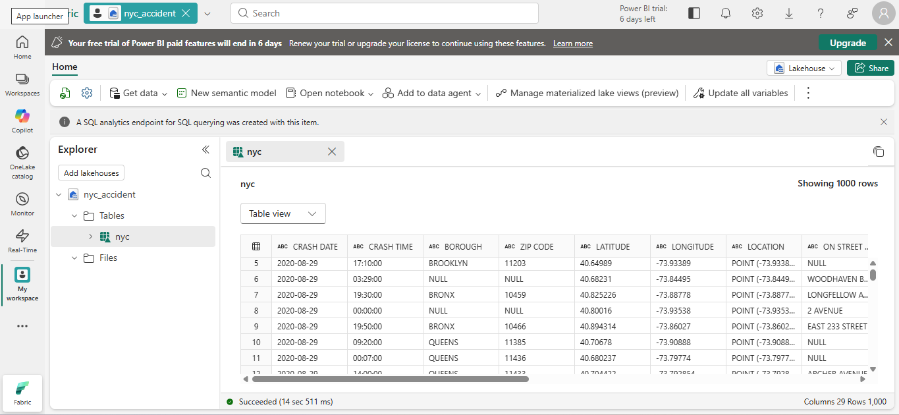
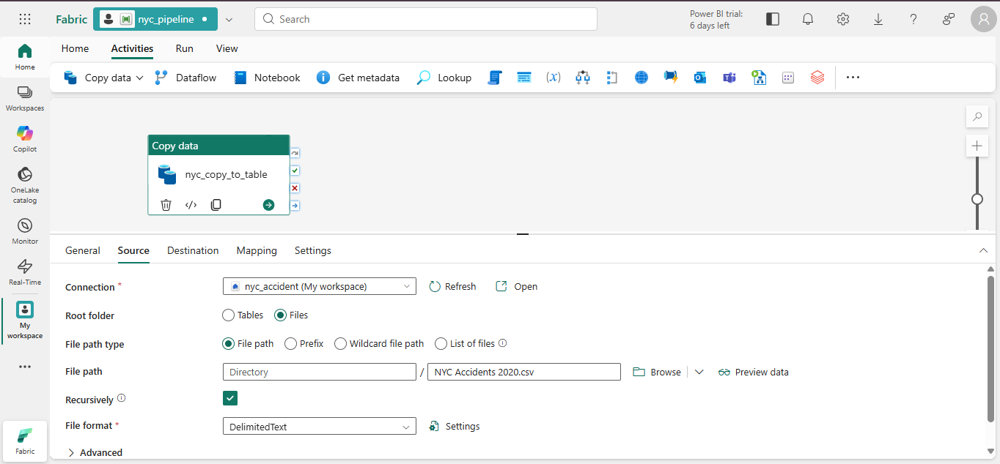
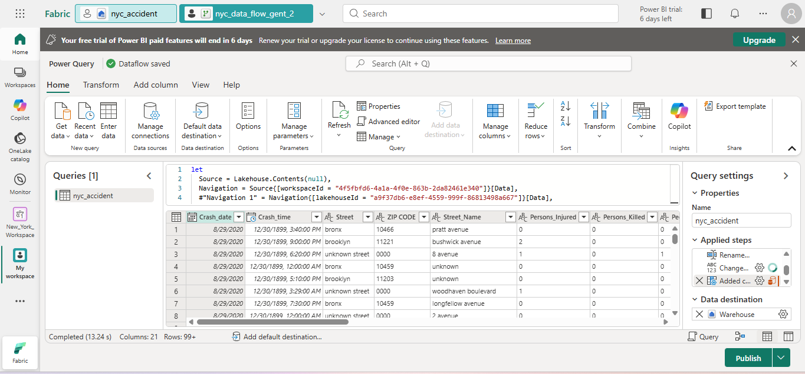
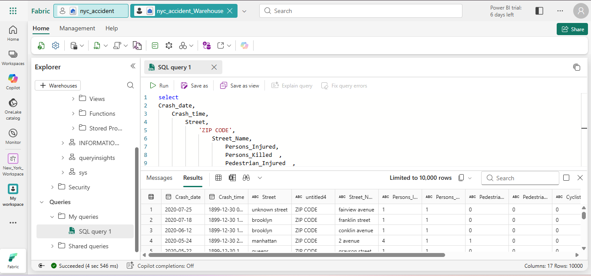
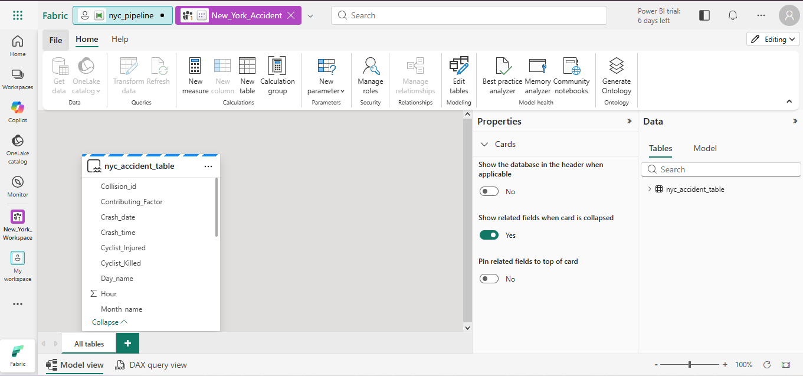

# NYC-Accident-Analysis-Microsoft-Fabric
End-to-end analysis of NYC motor vehicle accidents using Microsoft Fabric and Power BI, showcasing data ingestion, transformation, semantic modeling, and interactive dashboards

## 1. Lakehouse – Raw Data Storage
Raw accident data is loaded into the Lakehouse, providing a central repository for analysis.

  <!-- Replace with your Lakehouse image -->

---

## 2. Pipeline – Data Copy & Preparation
Data is copied from the Lakehouse into structured tables and prepared for transformation.

  <!-- Replace with your Pipeline image -->

---

## 3. Data Transformation
Data is cleaned, transformed, and structured to support analysis.

  <!-- Replace with your Transformation image -->

---

## 4. Data Warehouse
Transformed data is stored in the Data Warehouse for efficient querying.

  <!-- Replace with your Data Warehouse image -->

---

## 5. Semantic Model
Semantic model is created with measures, KPIs, and relationships to enable analytics.

  <!-- Replace with your Semantic Model image -->

---

## 6. Power BI Dashboard
Interactive dashboards visualize accident trends, hotspots, and insights.

<!-- Replace with your Power BI dashboard image -->

---

### Tools Used
- Microsoft Fabric
- Lake house
- Data Ware house
- Sementic Model
- Data Flow Gent_2
- Power BI
- SQL Query
  

---

